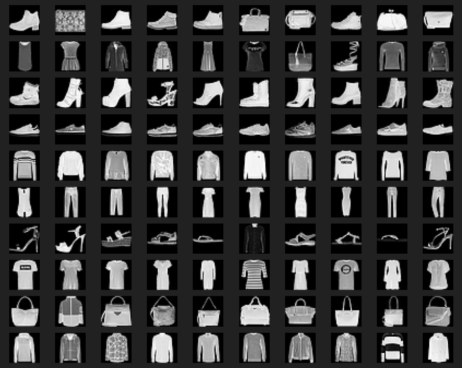
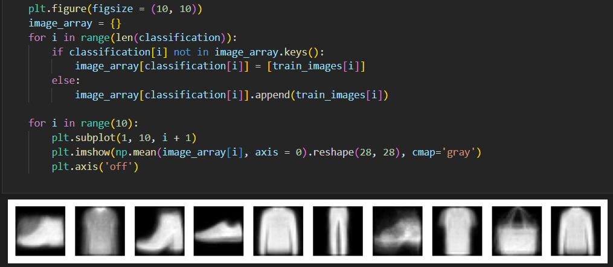
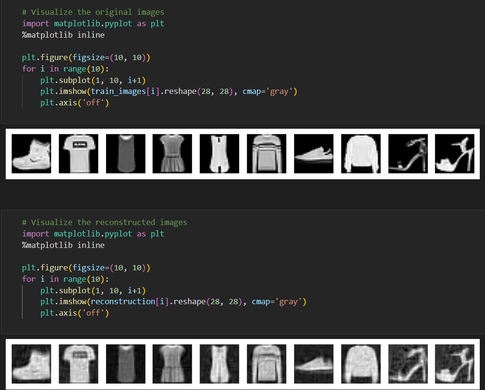
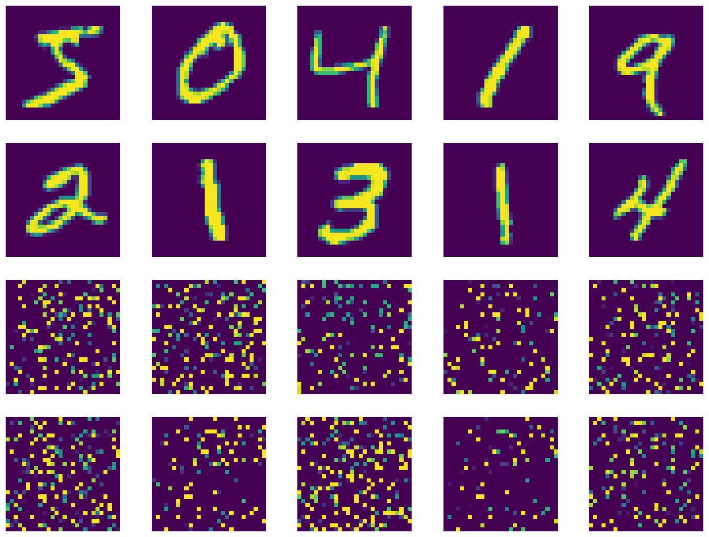
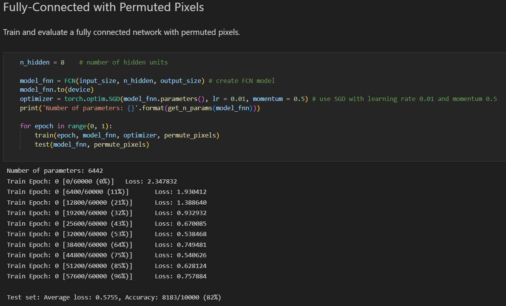

# neural network dimensionality reduction for image recognition 
Xi Liu 
This project is done for machine learning course at New York University in 2022 fall 
 
Dimensionality reduction part contains a numpy implementation of principal compoenent analysis, k-means clustering, and k-nearest neighbor from scratch. For the principal compoenent analysis part, mean is subtracted from each sample, then use centered matrix to calculate the covariance matrix whose entries are covariances, and compute eigenvectors of the covariance matrix to identify the direction of maximum variance. Then, principal component analysis is used on the train dataset to reduce data dimension from 784 to 100. There is a step to reverse the reduced principal components by taking the dot product of x reduced and eigenvectors and add the mean, then it creates a visualization of reconstructed images which look similar with original input images. The k-means clustering algorithm is a centroid based approach in which the distance between each data point and a centroid is computed using Euclidean distance function and choose the cluster from each point with the minimum distance between data point and centroid, and then identify the k number of groups in the dataset. Then k-nearest neighbor classification computing the most common label among k nearest neighbors is performed on the dataset and chosen an optimal value of k with the highest classification accuracy output from the model. 
 
Neural network part includes a multi-layer perceptron model using numpy from scratch and the training part of it uses the backpropagation algorithm, and it contains a fully connected neural network, and a convolutional neural network. In fully connected neural network, every neuron in a given layer is connected to all neurons in the other layer. Convolutional neural network includes convolutional, pooling, and fully connected layer. The convolution layer in convolutional neural network is specialized to extract information that has locality such as adjacent pixels in an image, since the convolution layer performs convolution operation each time between a small portion of the input matrix with a kernel matrix and store the sum of products into each entry of the output matrix. 
 
Decision tree part contains a numpy implementation of decision tree classifier from scratch, an application of decision tree, and an application of random forest. For the numpy implementation of decision tree, the best split is found by choosing the split with the maximum information gain which is calculated from the combined difference of gini index or entropy between the parent and child node. For decision tree application, DecisionTreeClassifier from sklearn.tree is used, classifier.fit(x_train, y_train) is to fit the model, classifier.predict(x_test) method has input parameter of unlabeled observations x_test, and the return value is predicted labels y. standard scaler is used to normalize the data, a for loop is used to generate and use n different seeds for each classifier. For random forest, RandomForestClassifier from sklearn.ensemble is used, an estimator_array is used to store the number of trees in each forest. classifier.fit(x_train, y_train) is to fit the model, classifier.predict(x_test) method has input parameter of observations x_test, and the return value is predicted labels y. standard scaler is used to normalize the data, a for loop is used to generate and use n different seeds for each classifier. 
 
Images produced after performing principal component analysis and k-means clustering on the data are shown below.

